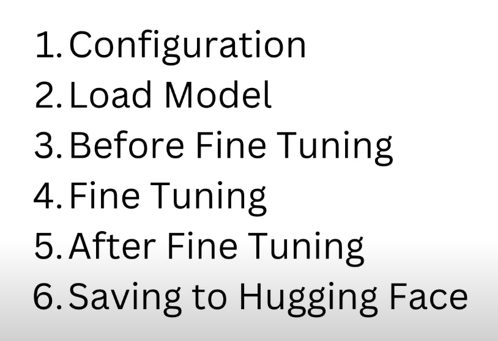

# How to Fine Tune Llama 3 for Better Instruction Following

## INDEX



---

## COMMANDS

UNSLOTH GitHub LINK: <https://github.com/unslothai/unsloth>

```
conda create --name unsloth_env python=3.10
conda activate unsloth_env
conda install pytorch-cuda=<12.1/11.8> pytorch cudatoolkit xformers -c pytorch -c nvidia -c xformers
pip install "unsloth[colab-new] @ git+https://github.com/unslothai/unsloth.git"
pip install --no-deps trl peft accelerate bitsandbytes
export HF_TOKEN=xxxxxxxxxxxxx
pip install wandb
wandb login
```

---
